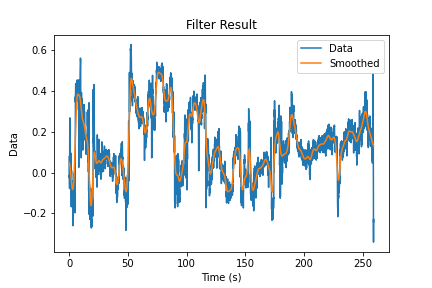

# Projeto 01 - Filtering a time series using a convolution filter and pthreads

Example of pthread performing the filtering of a time series using a convolution filter.

Code files:
- smooth.c: Project code itself, performs data reading and filtering
- Results.ipynb: Show the filtering results, and performs a time comparison using Python.

Data files:
- Data.txt: Time series
- Time.txt: Data timestamps

Presentation files:
- Apresentação.pdf: Course presentation (PT-BR)

Filter result:

