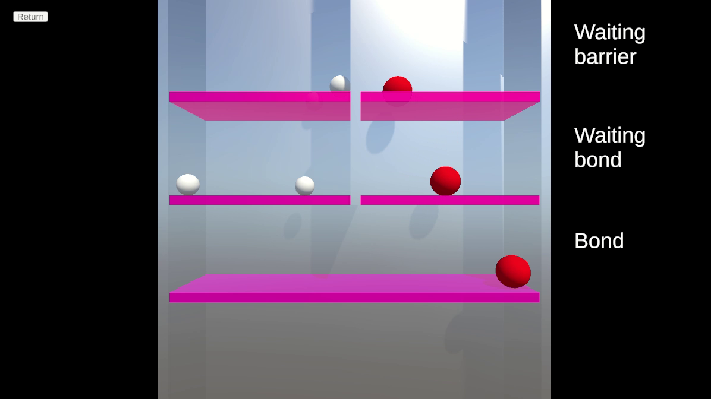
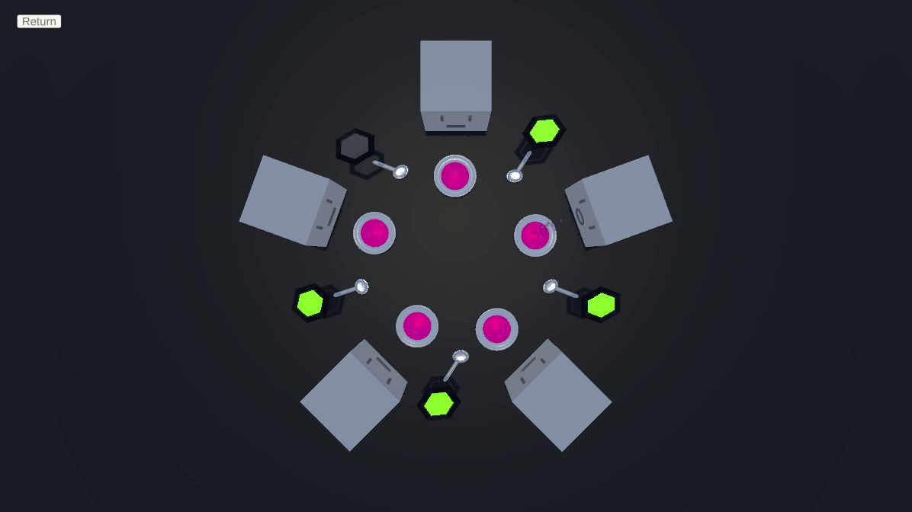

# Projeto 02 - Semaphores and animation

[Little Book of Semaphores](https://greenteapress.com/semaphores/LittleBookOfSemaphores.pdf) problems solutions using pthread semaphores. The C code generates a textual log that can be read in the application created in Unity to run an animation of the threads.

## Generated animations

["Building H2O" animation](https://youtu.be/lT_TVNUUUvw)

["Dining philosophers" animation](https://youtu.be/xxIHlpI8cXc)

## Files

Code files:
- lib: Library for outputting the semaphore logs
- src:
    - h2o.c: "Building H2O" problem solution.
    - philosophers: "Dining philosophers" problem solution.

Other files:
- logs: Generated logs.
- unity: Unity project.
- build: Compiled problem solutions.
- compile.bash: Compiles the problem solution.
- run.bash: Runs the problem solution and exports the log.
- Apresentação.pdf: Course presentation (PT-BR).

## Unity Application Usage
- Download "AnimaSemaphore" from [releases page](https://github.com/EltonCN/MC504-SistemasOperacionais/releases/tag/anima0.1.0).
- Unpack and start the application.
- Click on "Load Screenplay" and select the log file.
- Watch!